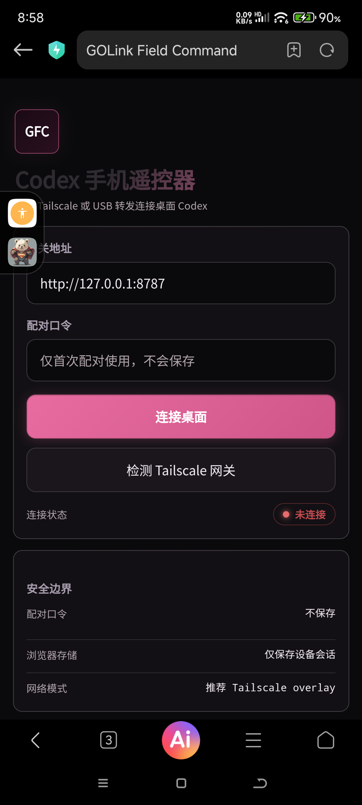
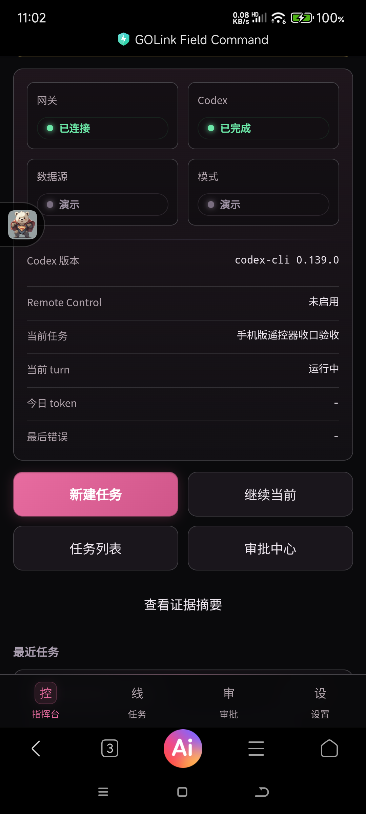
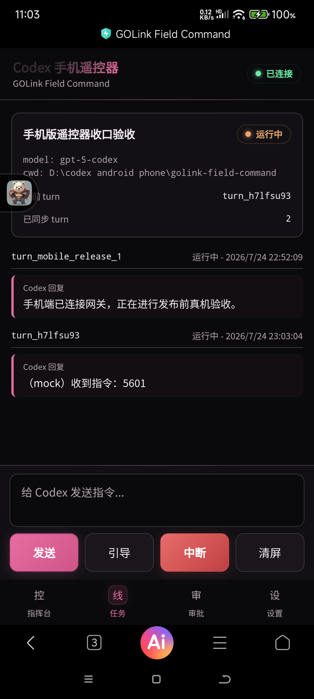

# DoCom — 随身 AI 指挥终端 / Mobile Command Center for Your Local Codex Gateway

**DoCom is a private mobile controller for a local Codex app-server gateway. You are outside; DoCom is in your hand; your desktop is at home. Send tasks, watch status, steer, interrupt, approve, collect evidence — without ever sending your conversations to the cloud.**

DoCom 是本地 Codex 网关的私人移动指挥终端：你在外面，DoCom 在手里，桌面机在家。下发任务、看状态、引导、打断、审批、收证据——手机不直连任何云端大模型。

> **Repository status.** This repository is a **portfolio / showcase** for the DoCom project (product name "GOLink Field Command" / docom 0.2): documentation and screenshots of the real build. **No binaries and no source code are published here.** DoCom is a private controller for the publisher's own Codex gateway — publishing the binaries or source would leak pairing/device-session internals and defeat the point of a private command channel. Every capability claim below is what the app actually does on a real device.
>
> 本仓库是 DoCom（GOLink Field Command / docom 0.2）项目的**作品展示**：真实构建的文档与截图。**不放任何二进制与源码**——DoCom 是发布者私有 Codex 网关的私人控制器，公开二进制或源码会泄露配对/设备会话内部机制。下方所有能力声明均为真机实测。

## What it is / 定位

```
人在外面 / You are outside
  -> DoCom (Android, in your hand)
  -> Desktop gateway (Tailscale / USB overlay, at home)
  -> Codex app-server (the work happens here)
```

- **Private, not cloud** — the phone never talks to OpenAI or any public LLM endpoint; it talks to your desktop gateway, and the gateway talks to Codex. Your threads stay on your machine.
- **Secure pairing** — one-time operator pairing token, or a fixed personal password stored with Windows DPAPI (never clear text). Device sessions are persisted as SHA-256 hashes, not bearer tokens. WebSocket uses a one-time ticket, not a token in the URL.
- **Command console** — gateway / Codex status, Codex version, current task, today's token usage, last error, all on one screen.
- **Tasks & threads** — task list, thread detail, synchronized with real Codex history; completed historical threads are read-only; start a new task with one tap.
- **Steer & interrupt** — guide an ongoing turn (steer) or interrupt it from the phone.
- **Approval center** — approve / deny pending approvals; approval requests are filtered by workspace before they reach the phone.
- **Evidence** — view evidence summaries for a thread from your phone.
- **Mobile input** — speech capture and OCR capture (ML Kit, on-device, best-effort) with explicit paste/send — nothing is sent without your tap.
- **Network modes** — Tailscale overlay (recommended, for daily "outside the house" use), USB reverse forwarding (local validation), TLS-terminated behind a trusted reverse proxy. Non-loopback HTTP requires an explicit deployment mode; insecure-LAN mode exists but is deliberately noisy and not for daily use.

## Screenshots / 截图

*(From the real build — docom 0.2 — 简体中文界面 / Simplified Chinese UI, dark theme)*

| Pairing / 配对 | Console / 控制台 | Thread / 任务对话 |
|---|---|---|
|  |  |  |

## Security model / 安全边界（summary）

- `/health` is public; everything else requires the operator token or a valid device session.
- WebSocket uses a one-time ticket; device sessions are stored as hashes; a phone can revoke its own session without the operator token.
- Workspace access is enforced server-side by realpath allowlist; approvals are filtered by workspace before reaching the phone.
- Fixed pairing passwords are optional, Windows-DPAPI encrypted, never printed or committed.
- Daily mode starts Codex with approval policy `never` so a mobile-started turn never blocks the desktop UI; approval testing is explicit (`on-request`).

## Status / 状态

docom **0.2** (2026-07): release-candidate baseline 5.6 frozen (pairing, dashboard, thread sync, read-only history), then the 0.2 enhancement package (one-command startup, Tailscale overlay validation, persistent gateway state, pairing diagnostics, current-device session management, Chinese troubleshooting, Android `docom` shell with reload/settings/speech/OCR, mobile multitask status, one-command Android launch, desktop status check). Private personal tool — UI is Simplified Chinese. Codex `app-server --stdio` remains experimental; real transport smoke is re-run after CLI upgrades.

docom 0.2（2026-07）：发布候选基线 5.6 已冻结（配对、控制台、线程同步、历史只读），随后 0.2 增强包（一键启动、Tailscale overlay 校验、持久网关状态、配对诊断、当前设备会话管理、中文排障、Android docom 壳、移动语音/OCR、多任务状态、Android 一键启动、桌面状态检查）。私人自用工具——UI 为简体中文。

## License / 许可

Evaluation license — see [LICENSE](LICENSE). This repository is a showcase; **commercial redistribution of any artifact is not permitted**.

## Disclaimer / 免责

DoCom commands a Codex agent that can perform real actions on your machine. It is a private tool for the publisher's own daily workflow; if you build something like it, keep the same security discipline (pairing, device sessions, workspace allowlists, overlay networks). DoCom 会指挥一个能在你机器上执行真实操作的 Codex agent——这是发布者私人工作流的自用工具；若你也构建类似工具，请保持同样的安全纪律。